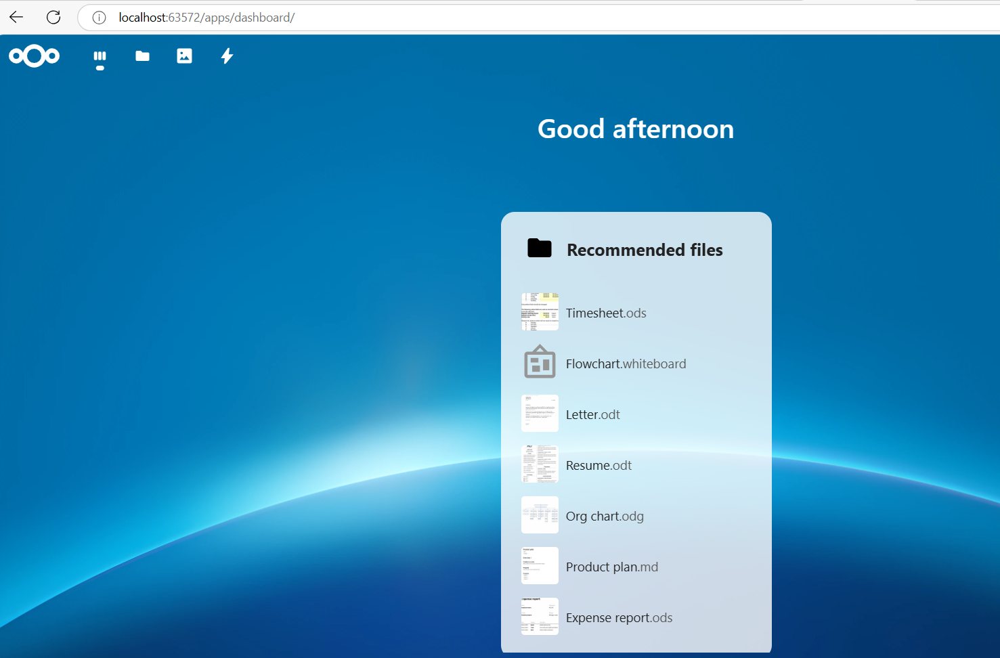
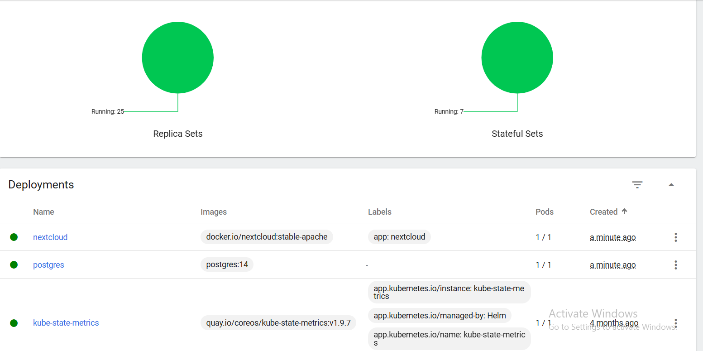
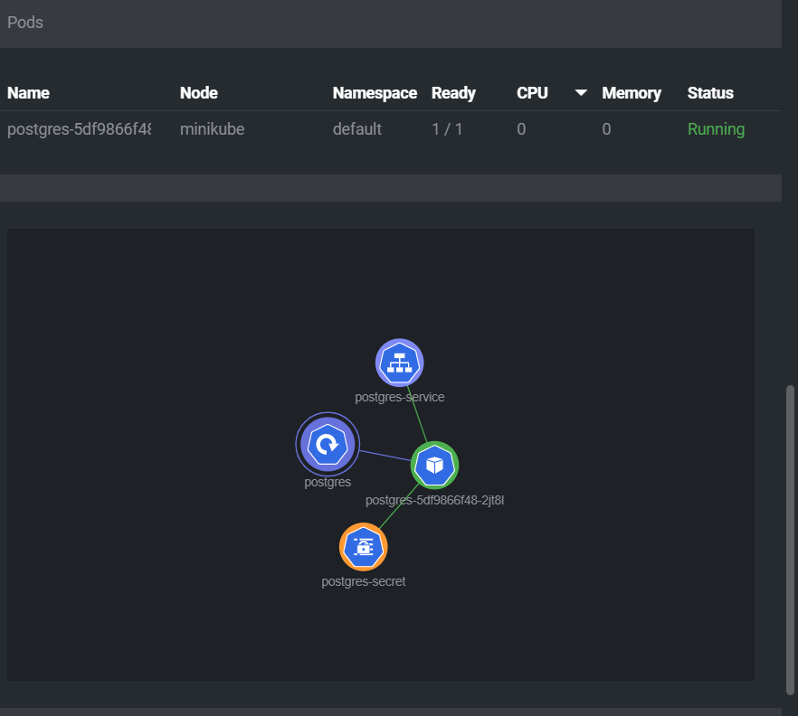
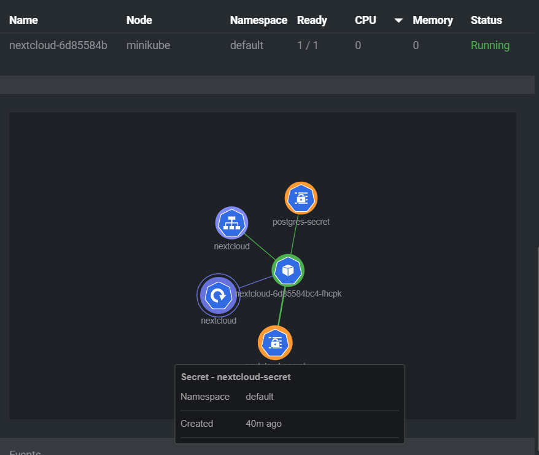

# Kubernetes Deployment: Описание и Вопросы

## Меню
- [Русский](#kubernetes-deployment-описание-и-вопросы)
- [English](#kubernetes-deployment-description-and-questions)

---

## Описание Kubernetes Deployment

Этот документ описывает процесс развертывания службы Nextcloud с использованием базы данных PostgreSQL в Kubernetes. Включены шаги по созданию необходимых объектов Kubernetes и проверке их работы.
### Images
Minikube dashboard:

NEXT cloud dashboard

Kube dashboard: 


### Дополнительные вопросы:
- Важно ли выполнять манифесты в этом порядке? Да, порядок важен, так как PostgreSQL должен быть развернут и настроен перед Nextcloud, чтобы Nextcloud мог подключиться к базе данных.
- Что произойдет, если уменьшить количество реплик postgres-deployment до 0, а затем снова увеличить до 1? Когда PostgreSQL уменьшен до 0, служба Nextcloud не сможет подключиться к базе данных. После увеличения количества реплик PostgreSQL, Nextcloud продолжит работать нормально.

### Дополнительные задачи:
- Переместить `POSTGRES_USER` и `POSTGRES_PASSWORD` из ConfigMap в Secrets.
- Переместить переменные Nextcloud (`NEXTCLOUD_UPDATE`, `ALLOW_EMPTY_PASSWORD` и т.д.) из Deployment в ConfigMap.
- Добавить liveness и readiness probes для Nextcloud.
- Image:
- Postgres Resource map

- NextCloud Resource map

### Обновленные YAML файлы:
#### postgres-secret.yaml:
```yaml
# ...existing code...
data:
  POSTGRES_USER: cG9zdGdyZXM=  # base64 encoded value of "postgres"
  POSTGRES_PASSWORD: bXlzZWN1cmVwYXNzd29yZA==  # base64 encoded value of "mysecurepassword"
  POSTGRES_DB: cG9zdGdyZXM=  # base64 encoded value of "postgres"
# ...existing code...
```

#### postgres-deployment.yaml:
```yaml
# ...existing code...
env:
  - name: POSTGRES_USER
    valueFrom:
      secretKeyRef:
        name: postgres-secret
        key: POSTGRES_USER
  - name: POSTGRES_PASSWORD
    valueFrom:
      secretKeyRef:
        name: postgres-secret
        key: POSTGRES_PASSWORD
  - name: POSTGRES_DB
    valueFrom:
      secretKeyRef:
        name: postgres-secret
        key: POSTGRES_DB
# ...existing code...
```

#### nextcloud-deployment.yaml:
```yaml
# ...existing code...
env:
  - name: NEXTCLOUD_UPDATE
    valueFrom:
      configMapKeyRef:
        name: nextcloud-configmap
        key: NEXTCLOUD_UPDATE
  - name: ALLOW_EMPTY_PASSWORD
    valueFrom:
      configMapKeyRef:
        name: nextcloud-configmap
        key: ALLOW_EMPTY_PASSWORD
  - name: NEXTCLOUD_TRUSTED_DOMАINS
    valueFrom:
      configMapKeyRef:
        name: nextcloud-configmap
        key: NEXTCLOUD_TRUSTED_DOMАINS
  - name: POSTGRES_HOST
    value: postgres-service
  - name: POSTGRES_DB
    valueFrom:
      secretKeyRef:
        name: postgres-secret
        key: POSTGRES_DB
  - name: POSTGRES_USER
    value: postgres
  - name: POSTGRES_PASSWORD
    valueFrom:
      secretKeyRef:
        name: postgres-secret
        key: POSTGRES_PASSWORD
  - name: NEXTCLOUD_ADMIN_USER
    value: admin
  - name: NEXTCLOUD_ADMIN_PASSWORD
    valueFrom:
      secretKeyRef:
        name: nextcloud-secret
        key: NEXTCLOUD_ADMIN_PASSWORD
livenessProbe:
  httpGet:
    path: /status.php
    port: 80
  initialDelaySeconds: 60
  periodSeconds: 10
  timeoutSeconds: 5
  failureThreshold: 5
  successThreshold: 1
readinessProbe:
  httpGet:
    path: /status.php
    port: 80
  initialDelaySeconds: 60
  periodSeconds: 10
  timeoutSeconds: 5
  failureThreshold: 5
  successThreshold: 1
# ...existing code...
```

#### nextcloud-configmap.yaml:
```yaml
# ...existing code...
data:
  NEXTCLOUD_UPDATE: "1"
  ALLOW_EMPTY_PASSWORD: "yes"
  POSTGRES_HOST: "postgres-service"
  NEXTCLOUD_TRUSTED_DOMАINS: "127.0.0.1"
  NEXTCLOUD_ADMIN_USER: "admin"
# ...existing code...
```
---

# Kubernetes Deployment: Description and Questions

## Menu
- [Русский](#kubernetes-deployment-описание-и-вопросы)
- [English](#kubernetes-deployment-description-and-questions)

---

## Description of Kubernetes Deployment

This document describes the process of deploying the Nextcloud service using a PostgreSQL database in Kubernetes. It includes steps for creating the necessary Kubernetes objects and verifying their operation.

### Additional Questions:
- Is it important to execute the manifests in this order? Yes, the order is important because PostgreSQL needs to be deployed and configured before Nextcloud so that Nextcloud can connect to the database.
- What happens if you scale the number of replicas of postgres-deployment to 0, then back to 1? When PostgreSQL is scaled to 0, the Nextcloud service will not be able to connect to the database. After scaling PostgreSQL back up, Nextcloud will continue to function normally.

### Additional Tasks:
- Move `POSTGRES_USER` and `POSTGRES_PASSWORD` from ConfigMap to Secrets.
- Move Nextcloud variables (`NEXTCLOUD_UPDATE`, `ALLOW_EMPTY_PASSWORD`, etc.) from Deployment to ConfigMap.
- Add liveness and readiness probes for Nextcloud.

### Updated YAML files:
#### postgres-secret.yaml:
```yaml
# ...existing code...
data:
  POSTGRES_USER: cG9zdGdyZXM=  # base64 encoded value of "postgres"
  POSTGRES_PASSWORD: bXlzZWN1cmVwYXNzd29yZA==  # base64 encoded value of "mysecurepassword"
  POSTGRES_DB: cG9zdGdyZXM=  # base64 encoded value of "postgres"
# ...existing code...
```

#### postgres-deployment.yaml:
```yaml
# ...existing code...
env:
  - name: POSTGRES_USER
    valueFrom:
      secretKeyRef:
        name: postgres-secret
        key: POSTGRES_USER
  - name: POSTGRES_PASSWORD
    valueFrom:
      secretKeyRef:
        name: postgres-secret
        key: POSTGRES_PASSWORD
  - name: POSTGRES_DB
    valueFrom:
      secretKeyRef:
        name: postgres-secret
        key: POSTGRES_DB
# ...existing code...
```

#### nextcloud-deployment.yaml:
```yaml
# ...existing code...
env:
  - name: NEXTCLOUD_UPDATE
    valueFrom:
      configMapKeyRef:
        name: nextcloud-configmap
        key: NEXTCLOUD_UPDATE
  - name: ALLOW_EMPTY_PASSWORD
    valueFrom:
      configMapKeyRef:
        name: nextcloud-configmap
        key: ALLOW_EMPTY_PASSWORD
  - name: NEXTCLOUD_TRUSTED DOMAINS
    valueFrom:
      configMapKeyRef:
        name: nextcloud-configmap
        key: NEXTCLOUD_TRUSTED_DOMАINS
  - name: POSTGRES_HOST
    value: postgres-service
  - name: POSTGRES_DB
    valueFrom:
      secretKeyRef:
        name: postgres-secret
        key: POSTGRES_DB
  - name: POSTGRES_USER
    value: postgres
  - name: POSTGRES_PASSWORD
    valueFrom:
      secretKeyRef:
        name: postgres-secret
        key: POSTGRES_PASSWORD
  - name: NEXTCLOUD_ADMIN_USER
    value: admin
  - name: NEXTCLOUD_ADMIN_PASSWORD
    valueFrom:
      secretKeyRef:
        name: nextcloud-secret
        key: NEXTCLOUD_ADMIN_PASSWORD
livenessProbe:
  httpGet:
    path: /status.php
    port: 80
  initialDelaySeconds: 60
  periodSeconds: 10
  timeoutSeconds: 5
  failureThreshold: 5
  successThreshold: 1
readinessProbe:
  httpGet:
    path: /status.php
    port: 80
  initialDelaySeconds: 60
  periodSeconds: 10
  timeoutSeconds: 5
  failureThreshold: 5
  successThreshold: 1
# ...existing code...
```

#### nextcloud-configmap.yaml:
```yaml
# ...existing code...
data:
  NEXTCLOUD_UPDATE: "1"
  ALLOW_EMPTY_PASSWORD: "yes"
  POSTGRES_HOST: "postgres-service"
  NEXTCLOUD_TRUSTED_DOMАINS: "127.0.0.1"
  NEXTCLOUD_ADMIN_USER: "admin"
# ...existing code...
```