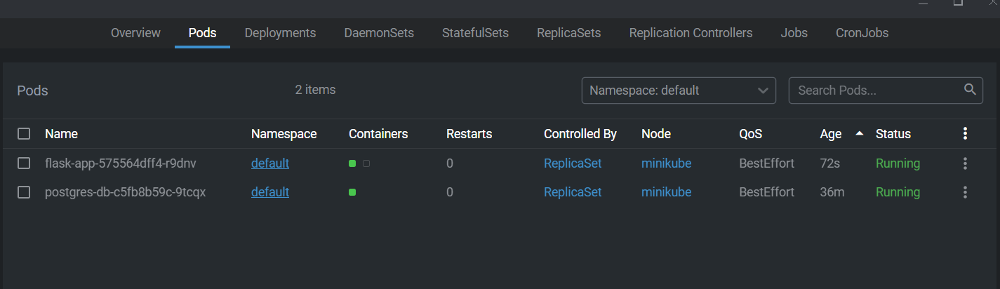

# Kubernetes Deployment: Описание и Вопросы

## Меню
- [Русский](#kubernetes-deployment-описание-и-вопросы)
- [English](#kubernetes-deployment-description-and-questions)

## Kubernetes Deployment: Описание и Вопросы

### Назначение каждого манифеста и компонента

- **charts/flask-app/values.yaml**: Определяет конфигурационные значения для Helm-чарта, включая Docker-образы, переменные окружения и порты для Flask-приложения и базы данных PostgreSQL.
- **charts/flask-app/templates/init-db-config.yaml**: ConfigMap для скрипта init-контейнера, который инициализирует базу данных PostgreSQL.
- **charts/flask-app/templates/db-service.yaml**: Определение сервиса для базы данных PostgreSQL, делая её доступной внутри кластера.
- **charts/flask-app/templates/db-deployment.yaml**: Определение деплоймента для базы данных PostgreSQL, включая переменные окружения и монтирование томов.
- **charts/flask-app/templates/app-deployment.yaml**: Определение деплоймента для Flask-приложения, включая init-контейнеры, переменные окружения и проверки состояния.
- **charts/flask-app/Chart.yaml**: Метаданные о Helm-чарте, включая версию чарта и версию приложения.
- **charts/flask-app/.helmignore**: Указывает файлы и директории, которые нужно игнорировать при упаковке Helm-чарта.

### Как создать и развернуть пользовательский Docker-образ

1. Убедитесь, что у вас есть файл `.env` с необходимыми переменными окружения:
    ```
    DOCKER_IMAGE=vanlahuynhduc/flask-app
    DOCKER_TAG=latest
    DOCKER_USERNAME=vanlahuynhduc
    DOCKER_PASSWORD=<pass>
    HELM_RELEASE=flask-app
    HELM_CHART_DIR=charts/flask-app
    ```

2. Запустите скрипт сборки и развертывания:
    ```bash
    ./build-and-deploy.sh
    ```

### Как взаимодействуют сервисы

- Flask-приложение подключается к базе данных PostgreSQL, используя переменные окружения, определенные в файле `values.yaml`.
- Flask-приложение предоставляет конечную точку для получения данных из базы данных.

### Назначение init-контейнера, тома, ConfigMap/Secret и проверок состояния

- **Init-контейнер**: Обеспечивает инициализацию базы данных PostgreSQL перед запуском Flask-приложения.
- **Том**: Используется для сохранения данных при перезапусках подов.
- **ConfigMap/Secret**: Хранит конфигурационные данные и конфиденциальную информацию, такую как учетные данные базы данных.
- **Проверки состояния**: Обеспечивают правильную работу Flask-приложения и базы данных PostgreSQL и их готовность к обслуживанию запросов.

### Скриншоты

#### Запущенные поды и сервисы
Поды:
- 1 для flask-приложения: 2 контейнера - init-скрипт и flask-приложение
- 1 для postgres


##### flask pod: 2 контейнера - init-скрипт и flask-приложение


##### Postgres


Сервисы: 

#### Успешные проверки состояния
Вызов конечной точки: /heathz


#### Взаимодействие между сервисами
- Как делятся данными между сервисами?
- Обмен секретами, чтобы flask-приложение могло использовать секреты из postgres, см. картинку:

- Flask-приложение будет вызывать postgres через URL сервиса: 
    ```
    DB_HOST: postgres-db.default.svc.cluster.local
    ```

---

## Kubernetes Deployment: Description and Questions

### Purpose of Each Manifest and Component

- **charts/flask-app/values.yaml**: Defines the configuration values for the Helm chart, including the Docker images, environment variables, and ports for the Flask app and PostgreSQL database.
- **charts/flask-app/templates/init-db-config.yaml**: ConfigMap for the init container script that initializes the PostgreSQL database.
- **charts/flask-app/templates/db-service.yaml**: Service definition for the PostgreSQL database, making it accessible within the cluster.
- **charts/flask-app/templates/db-deployment.yaml**: Deployment definition for the PostgreSQL database, including environment variables and volume mounts.
- **charts/flask-app/templates/app-deployment.yaml**: Deployment definition for the Flask app, including init containers, environment variables, and health checks.
- **charts/flask-app/Chart.yaml**: Metadata about the Helm chart, including the chart version and application version.
- **charts/flask-app/.helmignore**: Specifies files and directories to ignore when packaging the Helm chart.

### How to Build and Deploy the Custom Docker Image

1. Ensure you have a `.env` file with the required environment variables:
    ```
    DOCKER_IMAGE=vanlahuynhduc/flask-app
    DOCKER_TAG=latest
    DOCKER_USERNAME=vanlahuynhduc
    DOCKER_PASSWORD=<pass>
    HELM_RELEASE=flask-app
    HELM_CHART_DIR=charts/flask-app
    ```

2. Run the build and deploy script:
    ```bash
    ./build-and-deploy.sh
    ```

### How the Services Interact

- The Flask app connects to the PostgreSQL database using the environment variables defined in the `values.yaml` file.
- The Flask app provides an endpoint to retrieve data from the database.

### Purpose of Init Container, Volume, ConfigMap/Secret, and Health Checks

- **Init Container**: Ensures that the PostgreSQL database is initialized before the Flask app starts.
- **Volume**: Used to persist data across pod restarts.
- **ConfigMap/Secret**: Stores configuration data and sensitive information such as database credentials.
- **Health Checks**: Ensures that the Flask app and PostgreSQL database are running correctly and are ready to serve requests.

### Screenshots

#### Pods and Services Running
Pods:
- 1 for flask app: 2 containers - init script and flask app
- 1 for postgres


##### flask pod: 2 containers - init script and flask app


##### Postgres


Services: 

#### Successful Health Checks
Call endpoint: /heathz


#### Interaction Between Services
- How share beetween services?
- Share secrets so flaskapp can reflect secrets from postgress, see picture:

- Flask app will call postgres via service url: 
    ```
    DB_HOST: postgres-db.default.svc.cluster.local
    ```